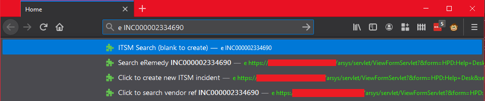

# Firefox Search Extensions

This repository contains two Firefox extensions I made during my employment. 
They allow me to search our tools directly from the Firefox address bar, rather
than navigating within the tool to perform a search.

Identifying company info (favicon and URLs) have been removed from this repo. Replace DeviceSearchTool and DOMAINNAMEREMOVED where appropriate.

To install, visit `about:debugging` in Firefox and add the appropriate `manifest.json` file. 

To package, create a ZIP file of the appropriate extension then upload it to 
the developer hub at https://addons.mozilla.org

## ITSM

This refers to our implementation of BMC Remedy (IT Service Management system).

To search for a ticket, press 'e' then enter the ticket in the form `INC000001234567` or `1234567`. 

To create a ticket, press 'e' then enter a blank, or click the suggestion from the drop down menu.

## Systems

This refers to a bespoke internal tool for monitoring network devices.

This tool is very much a legacy website - searching must be done by navigating to the appropriate page then sending a `POST` of the query, with all fields and a `javax.faces.ViewState` value set correctly. 

This required numerous workarounds. First was injecting the values in to the search form after the form was loaded. Then, I had to determine how to send the value `javax.faces.ViewState` with the request, which meant the page must be loaded from scratch before searching. Then, I learned I had to create the search button on the form seperately, as this also contained a value required for the search to sucessfully POST. Finally, the extension was only working in certain cases (from a new tab or the search page, not from an existing tab or a device page within the tool), so I had to find workarounds for Firefox behaviour such that the extension would work reliably.
